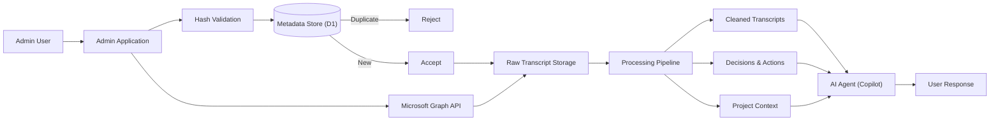
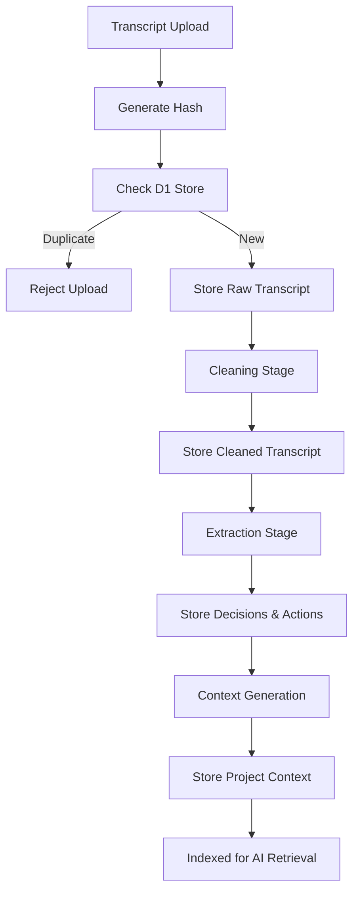
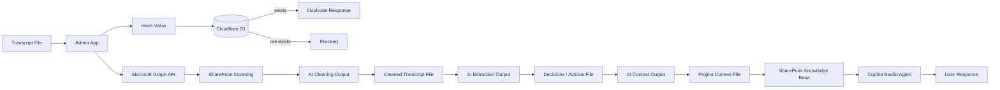
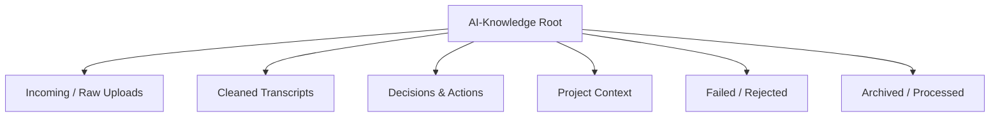
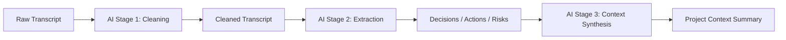
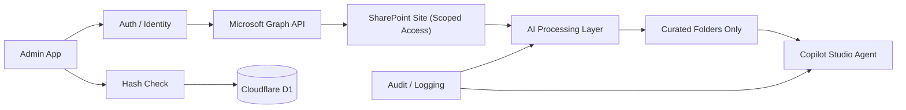
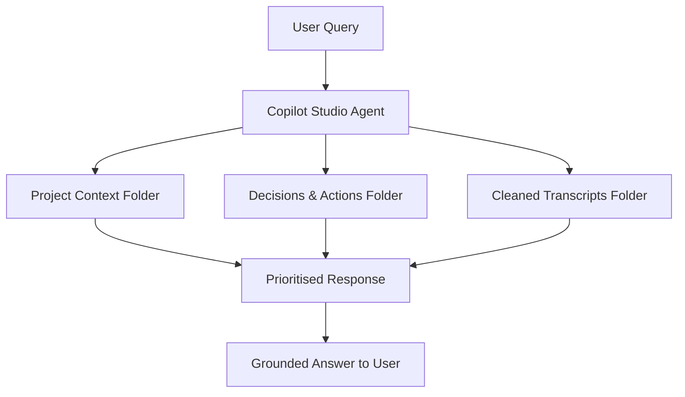
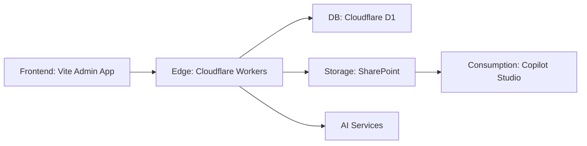

# 🧭 High-Level Solution Architecture

## 🧾 Summary

This diagram shows the full system lifecycle, from controlled ingestion through transformation and structured storage, to final AI consumption.

It highlights the separation between ingestion, processing, knowledge structuring, and AI interaction.

---

# ⚙️ Ingestion & Transformation Workflow

## 🧾 Summary

This workflow illustrates the step-by-step lifecycle of a transcript after upload, including validation, AI enrichment, structured storage, and knowledge indexing.

---

# 🔄 Data Flow Diagram

## 🧾 Summary

Highlights how data transforms across the system, from raw transcript to structured knowledge assets consumed by Copilot.

---

# 🗂️ SharePoint Information Architecture

## 🧾 Summary

Defines the structured SharePoint layout used to organise and curate knowledge for Copilot grounding.

---

# 🤖 AI Enrichment Stages

## 🧾 Summary

Shows how AI is applied in controlled stages to progressively enrich and structure transcript data.

---

# 🔐 Security and Governance

## 🧾 Summary

Illustrates access control, validation, and governance ensuring only approved and processed content is exposed to Copilot.

---

# 🧠 Copilot Knowledge Consumption

## 🧾 Summary

Shows how the Copilot agent prioritises structured knowledge sources to generate accurate and context-aware responses.

---

# 🧱 System Components View

## 🧾 Summary

Provides a simplified component-level overview of system layers and responsibilities across the platform.