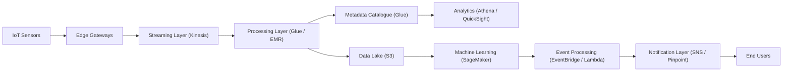
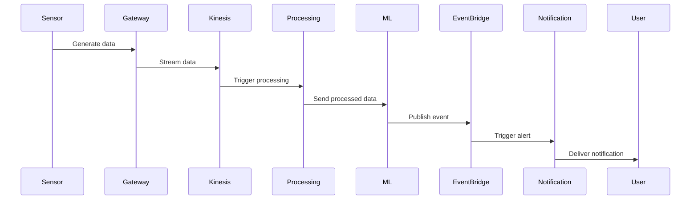
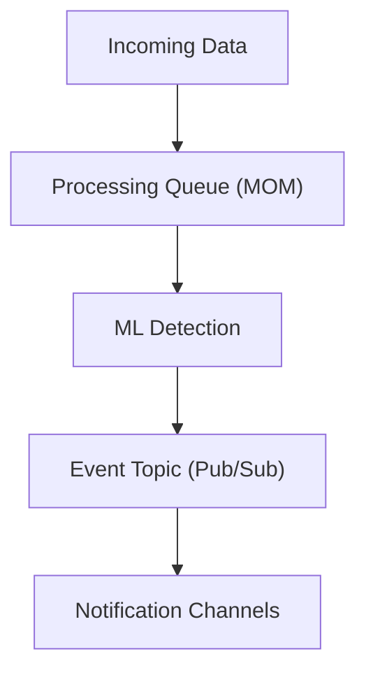

## 🎯 Purpose

This section provides visual representations of the system from different perspectives.

Each diagram focuses on a specific aspect of the architecture, including:

* overall system structure
* event-driven behaviour
* communication patterns

The goal is to make both **design intent and system behaviour clear**.

---

# 🏗️ 1. End-to-End Architecture

### 💡 What this shows

* High-level system structure
* Separation of ingestion, processing, storage, and delivery
* End-to-end data journey

---

# 🔄 2. Event-Driven Processing Flow

### 💡 What this shows

* Runtime behaviour
* Event-driven triggers
* Asynchronous flow

---

# 📡 3. Messaging Architecture (Pub/Sub + MOM)

### 💡 What this shows

* Separation of processing vs notification
* Use of messaging patterns
* Decoupled communication

---

# 🧠 Why multiple diagrams are used

A single diagram cannot effectively represent all aspects of a distributed system.

Instead:

| Diagram | Focus |
|---------|-------|
| Architecture | Structure |
| Event Flow | Behaviour |
| Messaging | Communication |

---

## 🧩 Design Approach

Each diagram was created to:

* isolate a specific concern
* avoid overloading a single view
* improve readability and clarity

---

## 💡 Architectural Insight

Breaking the system into multiple views reflects a key principle:

> **complex distributed systems should be understood through multiple perspectives, not a single representation**

---

## 🧠 Summary

These diagrams collectively show:

* how the system is structured
* how it behaves at runtime
* how components communicate

Together, they provide a complete view of the architecture.

---