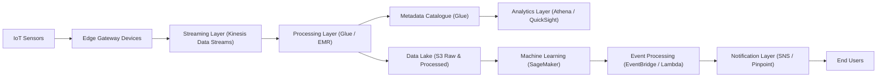

## 🎯 Purpose

This section provides a high-level view of the system architecture, showing how distributed components interact to support:

* real-time data ingestion
* scalable processing
* event detection
* notification delivery

The focus is on **how the system is structured**, rather than low-level implementation details.

---

## 🧠 Architectural Approach

The system is designed as a **hybrid distributed architecture**, combining:

* edge-based data generation (IoT sensors and gateways)
* cloud-based processing and storage
* event-driven communication between components

This allows the system to:

* scale horizontally
* operate asynchronously
* isolate failures
* support both real-time and batch workloads

---

## 🧩 High-Level Architecture



---

## 🔍 Architectural Layers

The system is organised into distinct layers, each with a specific responsibility.

---

### 📡 1. Data Generation & Ingestion

* Sensors collect seismic data across distributed locations
* Edge devices act as gateways to transmit data
* Data is streamed into the system via a managed streaming service

**Key goal:** Ensure reliable ingestion of continuous, high-volume data streams

---

### ⚙️ 2. Processing Layer

* Incoming data is processed using distributed compute services
* Supports both:
  * real-time transformations
  * batch processing

**Key goal:** Transform raw data into structured and usable formats

---

### 💾 3. Storage Layer

* Raw and processed data stored in a data lake
* Metadata catalogues enable structured querying

**Key goal:** Provide scalable, durable storage with query capabilities

---

### 📊 4. Analytics Layer

* Analytical tools query processed datasets
* Supports dashboards and exploratory analysis

**Key goal:** Enable insights from historical and processed data

---

### 🤖 5. Intelligence Layer

* Machine learning models analyse processed data
* Detect patterns and trigger events

**Key goal:** Convert processed data into actionable intelligence

---

### 📢 6. Event & Notification Layer

* Events are triggered based on analysis results
* Messaging systems distribute notifications to users

**Key goal:** Ensure timely and scalable delivery of alerts

---

## 🔄 Data Flow Summary

At a high level, the system follows this flow:

```text
Sensor Data → Stream Ingestion → Processing → Storage → Analysis → Event Trigger → Notification
```

Each stage operates independently, enabling:

* parallel processing
* fault isolation
* scalability

---

## ⚙️ Key Architectural Characteristics

---

### ⚡ Event-Driven Processing

System reacts to incoming data and triggers downstream actions

---

### 🔁 Asynchronous Communication

Components interact through messaging and streaming

---

### 🧩 Decoupled Components

Each layer operates independently

---

### 📈 Horizontal Scalability

System can scale based on data volume

---

### 🛡️ Fault Isolation

Failures in one component do not cascade across the system

---

## 💡 Why This Architecture Works

This design ensures that:

* high-volume data can be processed efficiently
* real-time events can be detected with low latency
* notifications can be delivered reliably
* the system can evolve without major redesign

---

## 🧠 Summary

The architecture demonstrates how a distributed system can be structured into layered components that work together to:

* ingest data at scale
* process it efficiently
* generate insights
* deliver timely actions

The emphasis is on **decoupling, scalability, and event-driven design**, which are essential for modern distributed systems.