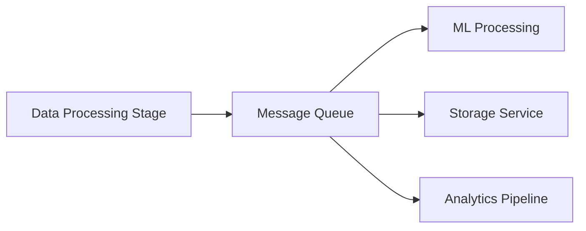

## 🎯 Purpose

This section explains how components in the system communicate using **asynchronous messaging patterns**, specifically:

* Publish–Subscribe (Pub/Sub)
* Message-Oriented Middleware (MOM)

These models enable the system to remain:

* decoupled
* scalable
* resilient

---

## 🧠 Why Messaging is Required

In a distributed system, direct communication between components leads to:

* tight coupling
* reduced scalability
* fragile dependencies

Instead, this system uses messaging to:

> **separate producers and consumers, allowing each component to operate independently**

---

## 📡 Publish–Subscribe Model

### 🔍 Concept

In the Pub/Sub model:

* a producer publishes an event
* multiple consumers subscribe to that event
* all subscribers receive the message independently

---

### 🧩 Implementation in the System

* Event detection layer publishes alerts
* Notification services subscribe to those events
* Multiple delivery channels receive the same event

---

### 📊 Diagram — Pub/Sub Flow

```mermaidjs
flowchart LR

    A["Event Producer (ML Detection)"] --> B["SNS Topic"]

    B --> C["SMS Notification"]
    B --> D["Mobile App"]
    B --> E["Email Service"]
    B --> F["External Systems"]
```

---

### ✅ Benefits

* supports multiple consumers
* enables broadcast-style communication
* simplifies addition of new subscribers

---

### ⚠️ Trade-Off

* no guarantee all consumers process at the same speed
* requires monitoring and retry mechanisms

---

## 📬 Message-Oriented Middleware (MOM)

### 🔍 Concept

MOM is used for **reliable, asynchronous message delivery** between components.

Messages are:

* queued
* processed independently
* retried if necessary

---

### 🧩 Implementation in the System

* processing stages communicate via message queues
* tasks are decoupled and executed asynchronously
* failures can be retried without affecting upstream systems

---

### 📊 Diagram — MOM Flow



---

### ✅ Benefits

* reliable message delivery
* decouples processing stages
* supports retry and fault tolerance

---

### ⚠️ Trade-Off

* introduces latency compared to direct calls
* requires queue management and monitoring

---

## 🔄 Combined Communication Model

In this system, both models are used together:

```mermaidjs
flowchart TD

    A["Incoming Data Event"] --> B["Processing Queue (MOM)"]

    B --> C["ML Detection"]

    C --> D["Event Topic (Pub/Sub)"]

    D --> E["Notification Services"]
```

---

## 🧠 When Each Model is Used

| Scenario | Model Used | Reason |
|----------|------------|--------|
| Processing pipeline | MOM        | Reliable task execution |
| Event notification | Pub/Sub    | Broadcast to multiple consumers |
| Background processing | MOM        | Decoupled execution |
| User alerts | Pub/Sub    | Multi-channel delivery |

---

## ⚙️ Architectural Impact

Using these models enables:

### 🔁 Decoupling

Producers and consumers do not depend on each other

---

### 📈 Scalability

Components can scale independently

---

### 🛡️ Reliability

Messages are not lost during failures

---

### ⚡ Flexibility

New consumers can be added without changing producers

---

## 💡 Why This Matters

Without messaging:

* system becomes tightly coupled
* scaling becomes difficult
* failures propagate across components

With messaging:

> **the system behaves as a loosely connected set of independent services**

---

## 🧠 Summary

This system uses a combination of:

* **Message-Oriented Middleware** for reliable processing
* **Publish–Subscribe** for event distribution

Together, these patterns enable:

* scalable communication
* resilient processing
* flexible system evolution