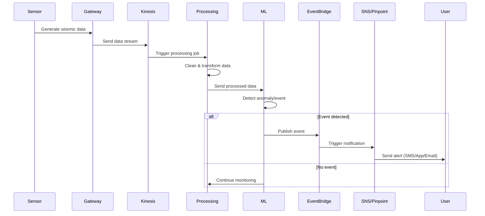

## 🎯 Purpose

This section explains how data moves through the system from ingestion to notification, focusing on:

* event generation
* asynchronous processing
* system reactions to incoming data

The goal is to show how the architecture behaves **in real time**, rather than just how it is structured.

---

## 🧠 Event-Driven Model

The system follows an **event-driven architecture (EDA)**, where:

* incoming data acts as an event
* processing stages react to events
* downstream components are triggered automatically

This ensures:

* loose coupling between components
* scalability under varying load
* real-time responsiveness

---

## 🔄 End-to-End Flow

---

## 🔍 Flow Breakdown

---

### 📡 1. Event Generation

* Sensors continuously generate seismic data
* Each data point represents a potential event

👉 The system treats incoming data as a **stream of events**

---

### 🚀 2. Stream Ingestion

* Data is sent to a streaming platform
* Events are buffered and made available for processing

👉 Enables:

* high-throughput ingestion
* decoupling from processing

---

### ⚙️ 3. Processing & Transformation

* Data is cleaned and normalised
* Structured format is prepared for analysis

👉 Ensures consistency before downstream use

---

### 🤖 4. Event Detection (ML Layer)

* Machine learning models analyse processed data
* Patterns or anomalies are identified

👉 Converts raw data into **meaningful signals**

---

### 📢 5. Event Publication

* When a condition is met, an event is published
* Event is sent to an event bus

👉 Decouples detection from notification

---

### 📡 6. Notification Distribution

* Notification services subscribe to events
* Alerts are sent via multiple channels

👉 Supports:

* scalability
* multiple consumers
* flexible delivery

---

## ⚡ Asynchronous Behaviour

All major components operate **asynchronously**, meaning:

* producers do not wait for consumers
* processing happens independently
* system can handle bursts of data

👉 This improves:

* performance
* resilience
* scalability

---

## 🧩 Decoupling in Action

The system separates:

* data ingestion
* processing
* analysis
* notification

Each stage communicates via events, not direct calls.

👉 Result:

* components can evolve independently
* failures are isolated
* system is easier to scale

---

## 🛡️ Failure Handling

Event-driven design allows:

* retry mechanisms for failed processing
* buffering of events during spikes
* delayed processing without data loss

👉 Ensures reliability even under stress

---

## 🔄 Real-Time vs Continuous Processing

The system supports both:

### ⚡ Real-Time Processing

* event detection
* immediate notification

---

### 📊 Continuous Processing

* data enrichment
* analytics
* model improvement

---

## 💡 Why This Approach Works

Event-driven flow ensures that:

* data is processed as it arrives
* critical events are handled quickly
* system remains responsive under load

---

## 🧠 Summary

This system demonstrates how an event-driven architecture can:

* transform continuous data streams into actionable events
* decouple system components
* enable real-time responsiveness
* support scalable, distributed processing