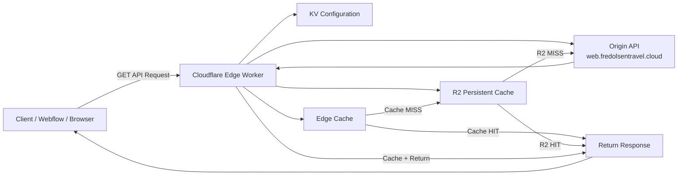
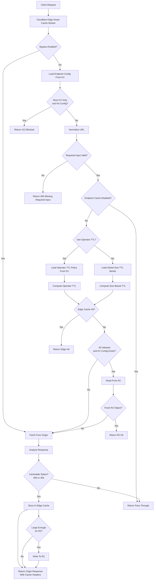
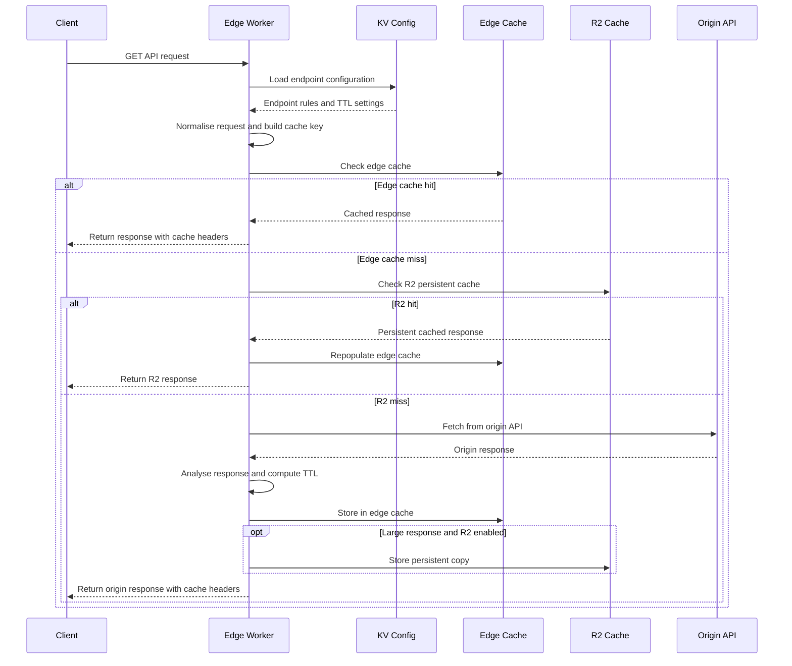
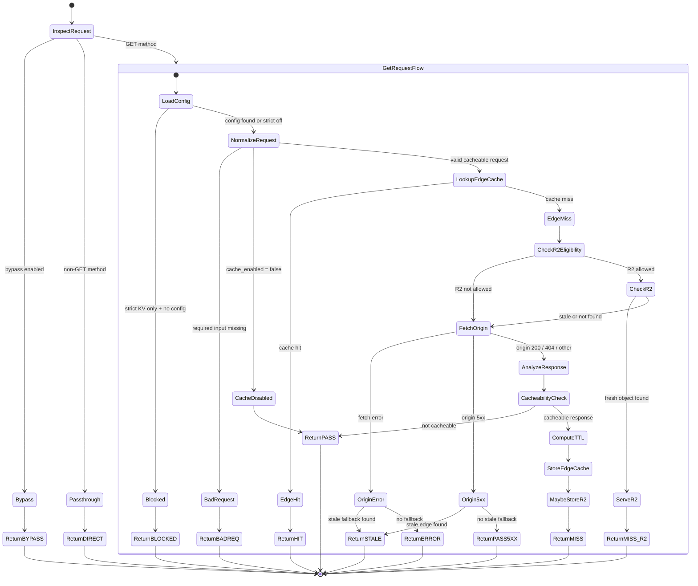
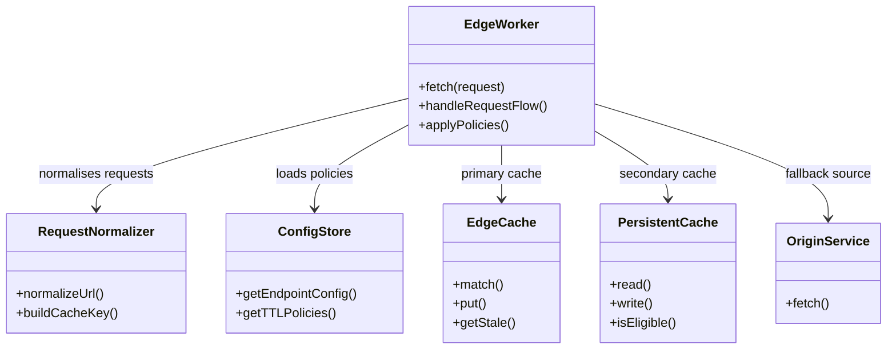
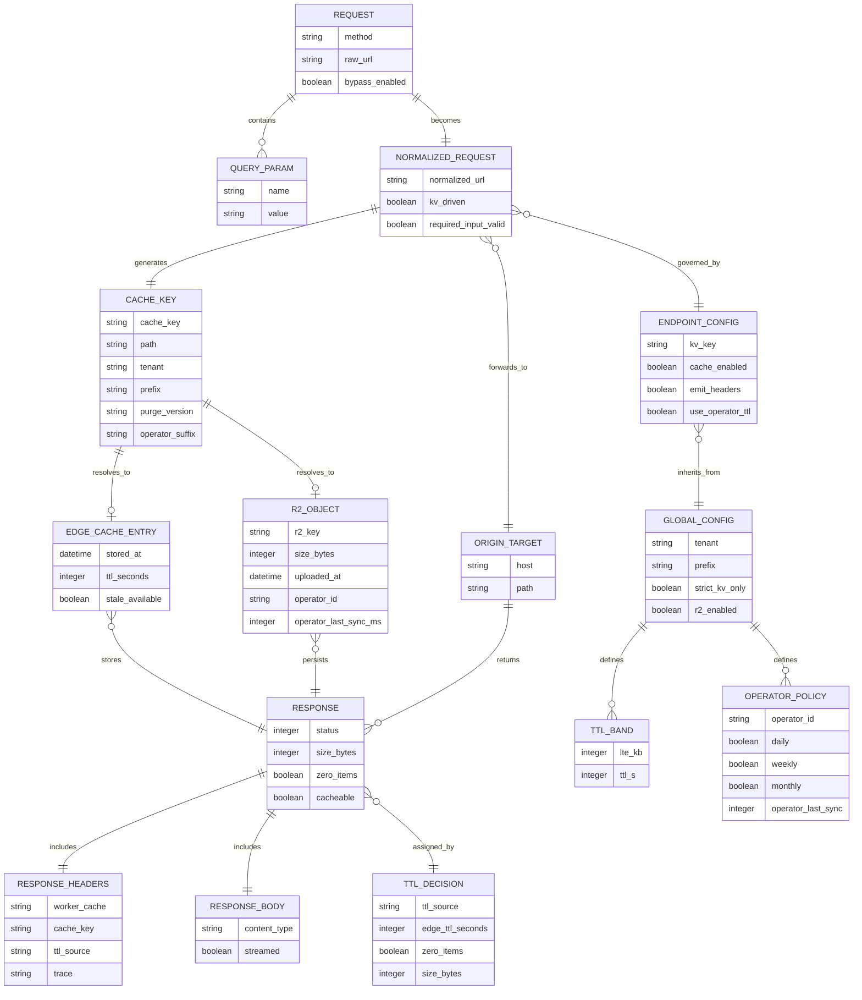
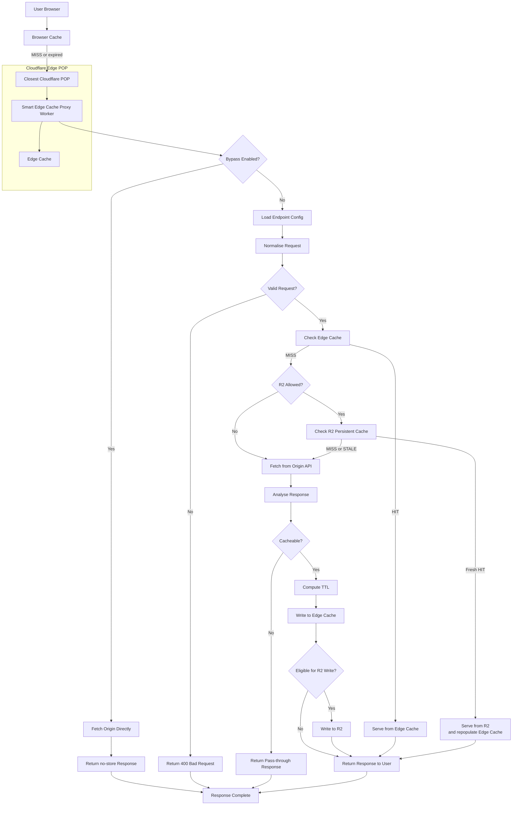
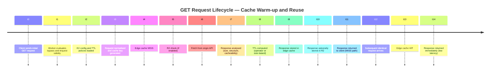
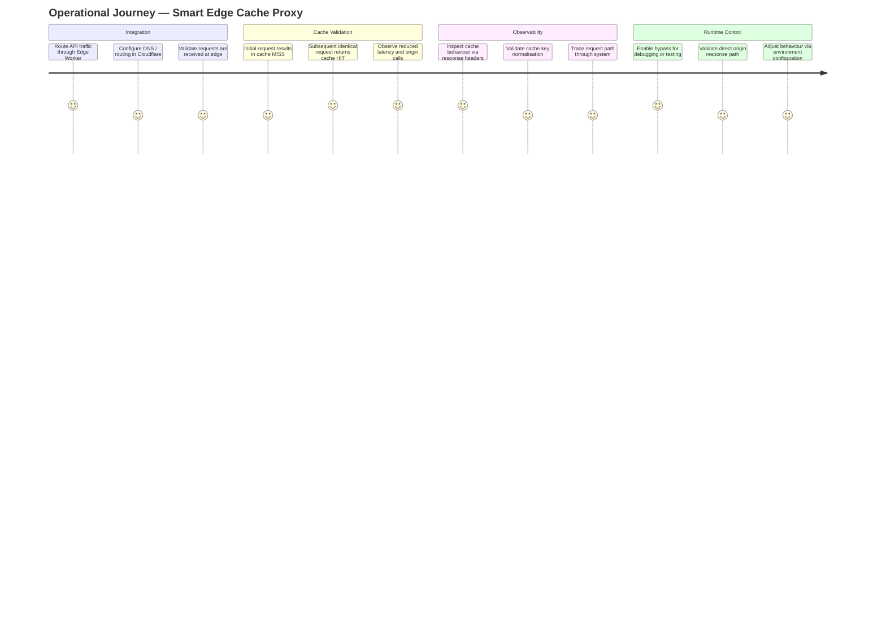
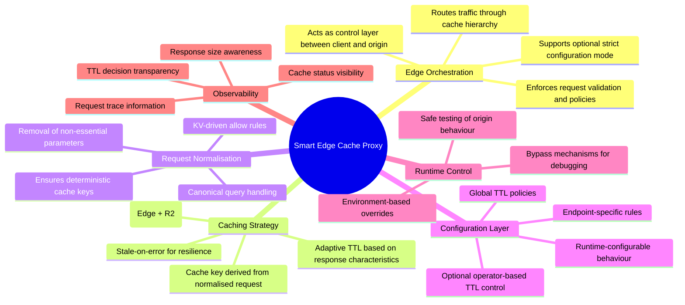

## 🧭 Introduction

Visual diagrams are an essential part of architecture documentation because they allow complex systems to be understood quickly. While the written sections of this documentation explain how the Smart Edge Cache Proxy behaves, diagrams illustrate how the different components interact and how requests flow through the system.

This section provides a collection of architectural diagrams that describe the major structural and behavioural aspects of the Smart Edge Cache Proxy. These diagrams complement the explanations provided in the architecture, caching, and operations sections of this case study.

Each diagram focuses on a specific aspect of the system, such as request processing, caching hierarchy, configuration behaviour, or observability.

---

# 🌐 Context Diagram

The context diagram shows where the Smart Edge Cache Proxy sits within the broader system architecture.

Client Applications\n        │\n        ▼\nCloudflare Edge Network\n        │\n        ▼\nSmart Edge Cache Proxy (Worker)\n        │\n        ▼\nBackend APIs / Origin Services

The proxy acts as an intermediary layer that interprets requests, manages caching behaviour, and controls interactions with backend APIs.

**Purpose of this diagram**

• Defines system boundaries\n• Shows external dependencies\n• Establishes the role of the proxy in the architecture

# 🏗 High-Level Architecture

This diagram shows the main architecture of the Smart Edge Cache Proxy. The Cloudflare Worker acts as the edge orchestration layer between the client and the origin API. It uses KV for configuration, Edge Cache for low-latency responses, and R2 as a persistent cache tier before falling back to the origin API.

---

# 🔁 Cache Decision Flow — Detailed Runtime Logic

This diagram shows the detailed runtime decision path used by the worker. It explains how the system handles bypass mode, endpoint configuration, strict validation, TTL selection, edge cache lookup, optional R2 fallback, origin fetch, and cache write behaviour.

The purpose of this diagram is to make cache behaviour explicit and predictable, which is important when operating a configurable caching layer in production.

# 🔄 Full Runtime Sequence — Exceptions and Failure Paths

This sequence diagram shows the normal request lifecycle through the Smart Edge Cache Proxy. The worker loads endpoint rules from KV, normalises the request, checks the edge cache, falls back to R2 when available, and only contacts the origin API when no cached response can be reused.

The purpose of this view is to explain the main interaction pattern without including every operational exception.

# 🧭 Cache Processing States — Runtime Behaviour

This state diagram shows the runtime states the worker can move through while processing a request. It is useful for understanding the different outcomes produced by the proxy, including bypass, pass-through, blocked requests, edge cache hits, R2 hits, stale fallback, and origin misses.

Unlike the sequence diagram, which focuses on interaction between components, this diagram focuses on the internal state transitions inside the worker.

---

# 🧱 Logical Components — Edge Orchestration Layer

This diagram shows the logical components within the edge orchestration layer. The Edge Worker coordinates request processing, using a normalisation component to ensure deterministic cache keys, a configuration store to apply runtime policies, and a multi-layer cache strategy consisting of edge and persistent storage before falling back to the origin service.

The goal of this design is to separate concerns clearly while keeping the system flexible, configurable, and scalable.

# 🗃️ Logical Runtime Data Model

This model helps explain the logical objects involved in request processing. A raw request is first normalised, then converted into a deterministic cache key. That key is used to resolve possible cached responses from the edge cache or R2. If no cached response exists, the origin response is analysed and assigned a TTL decision before being stored or returned.

The diagram is useful for technical audiences because it shows the relationship between configuration, cache identity, TTL policy, and response handling.

# 🌍 Delivery Path — Browser, Edge and Origin

# 🕒 Request Lifecycle — Cache Warm-up Behaviour

This timeline illustrates how the system behaves over time. The first request typically results in a cache miss and triggers origin processing, after which the response is cached. Subsequent identical requests are served directly from the edge cache, significantly reducing latency and backend load.

This helps demonstrate the performance benefits of caching as traffic patterns stabilise.

# 🧑‍💻 Operational Journey — Adopting the Edge Cache Proxy

This diagram illustrates how the solution is adopted and operated in practice. It shows how traffic is routed through the edge, how caching behaviour is validated, and how operators can observe and control runtime behaviour.

The goal is to ensure that the system is not only performant, but also transparent and easy to operate in a production environment.

# 🧠 Smart Edge Cache Proxy — Capability Overview

This mindmap provides a high-level view of the system capabilities. It summarises how the solution handles request orchestration, caching strategy, configuration, and operational control.

The purpose of this view is to quickly communicate the core responsibilities of the system without focusing on implementation details.

# 🧭 Summary

The diagrams in this section provide a visual representation of how the Smart Edge Cache Proxy operates and how its different components interact across the request lifecycle.

Together, they illustrate several important aspects of the system, including the overall architectural structure, the path taken by requests as they move through the edge worker, and the decision logic used to determine whether responses should be served from cache, persistent storage, or the origin API.

They also highlight how caching behaviour is influenced by configuration stored in KV, how URL normalisation ensures deterministic cache keys, and how optional R2 storage provides a persistent tier for large responses. In addition, the diagrams demonstrate how diagnostic headers, logging, and runtime controls allow engineers to observe system behaviour and troubleshoot issues in production environments.

Taken together, these diagrams provide a concise visual overview of the Smart Edge Cache Proxy, complementing the detailed architectural explanations presented throughout the rest of this documentation.